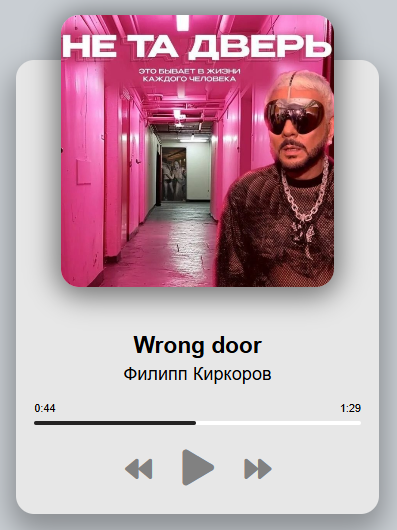
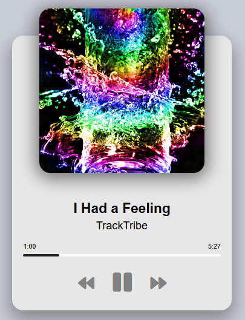

# music-player (музыкальный проигрыватель)
Описание:  
Музыкальный проигрыватель обладает следующим функционалом: 
  - управление музыкальным потоком осуществляется тремя кнопками ("Play", "Previous", "Next"); 
  - при повторном нажатии кнопки "Play" проигрывание переходит в режим "Pause"; 
  - реализована возможность перехода на желаемый временной интервал музыкального трека путем нажатия курсором на панель progress bar; 
  - текущее время проигрывания изменяется вместе с временной полоской панели progress bar; 
  - при достижении времени окончания трека автоматически запускается следующий трек; 
  - при переходе на новый музыкальный трек обновляются обложка музыкального альбома, название песни, имя исполнителя, цифровой дисплей продолжительности трека (в минутах и секундах); 
  - при окончании проигрывания финальной песни альбома начинается проигрывание первой песни альбома. 
Музыкальный проигрыватель mobile responsible (реализовано через Media Query). 
В коде используются textContent свойства взамен innerText, что позволяет ускорить производительность проигрывателя при переходе к новому музыкальному треку. 
Первый музыкальный трек сгенерирован с помощью сервиса на основе искусственного интеллекта GigaChat Сбер. 
 

